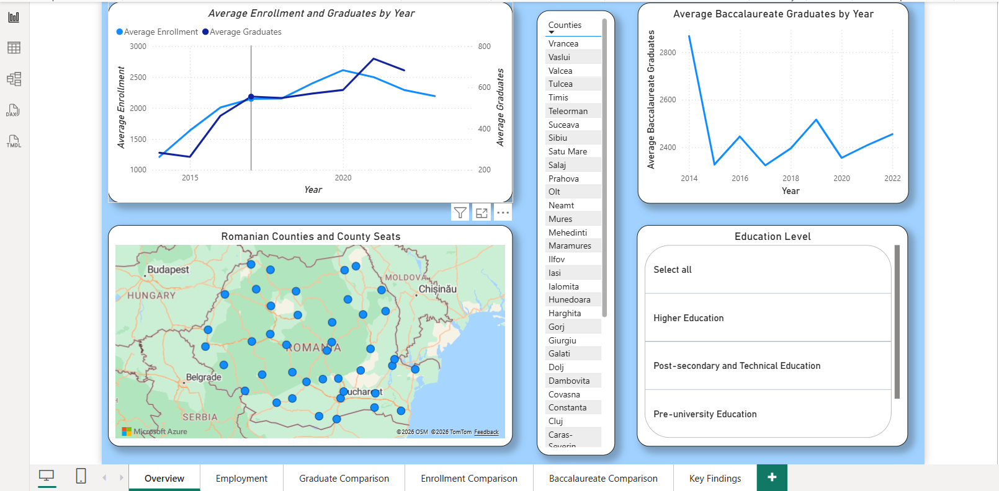
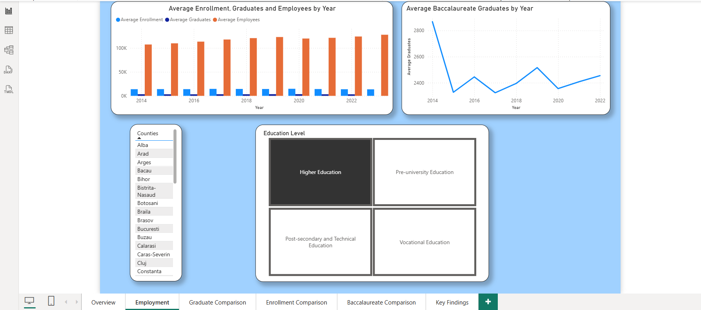
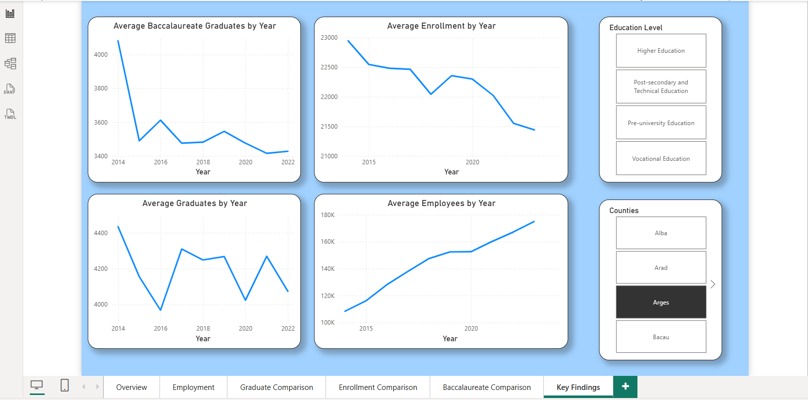

# Education and Employment in Romania – Power BI Dashboard

## Overview

This project explores education and employment indicators across Romanian counties between 2014 and 2023.

The dashboard was developed in Power BI using data from the Romanian National Institute of Statistics (INS) TEMPO-Online database.

The analysis focuses on enrollment, graduates, Baccalaureate graduates and employment, with comparisons across counties, years and education levels.

## Dashboard Pages

The report contains six pages:

- **Overview** – general trends in enrollment, graduates and Baccalaureate graduates, together with county-level geographic information.
- **Employment** – comparison of enrollment, graduates, employees and Baccalaureate graduates over time.
- **Graduate Comparison** – comparison of average graduates and employees across selected counties and education levels.
- **Enrollment Comparison** – comparison of average enrollment and employees.
- **Baccalaureate Comparison** – comparison of Baccalaureate graduates and employees across counties.
- **Key Findings** – summary of the main trends over time.

## Main Indicators

- Average Enrollment
- Average Graduates
- Average Baccalaureate Graduates
- Average Employees

## Education Categories

- Pre-university Education
- Vocational Education
- Post-secondary and Technical Education
- Higher Education

## Data Model

The Power BI model uses shared dimension tables for:

- County
- Year
- Education Level

These dimensions are connected to the relevant data tables using one-to-many relationships.

## Tools and Skills

- Power BI
- Data modeling
- Data visualization
- Interactive filtering
- Descriptive analysis
- Comparative analysis

## Data Source

Romanian National Institute of Statistics (INS) – TEMPO-Online.

Period analysed: **2014–2023**.

## Methodology

More information about the structure of the analysis is available in [methodology.md](methodology.md).

## Dashboard Preview

### Overview

### Employment

### Key Findings

## Power BI File

The complete Power BI report is available here:

[Download the Power BI report](https://github.com/osaci-cosmin/romania-education-employment-powerbi/releases/download/v1.0/Romania_Education_Employment_Analysis.pbix)
