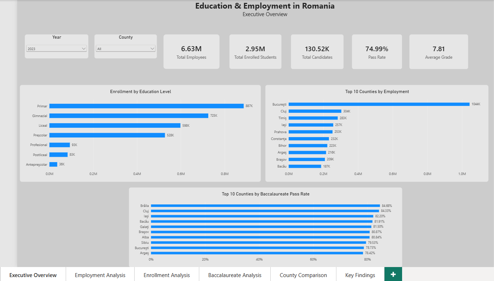
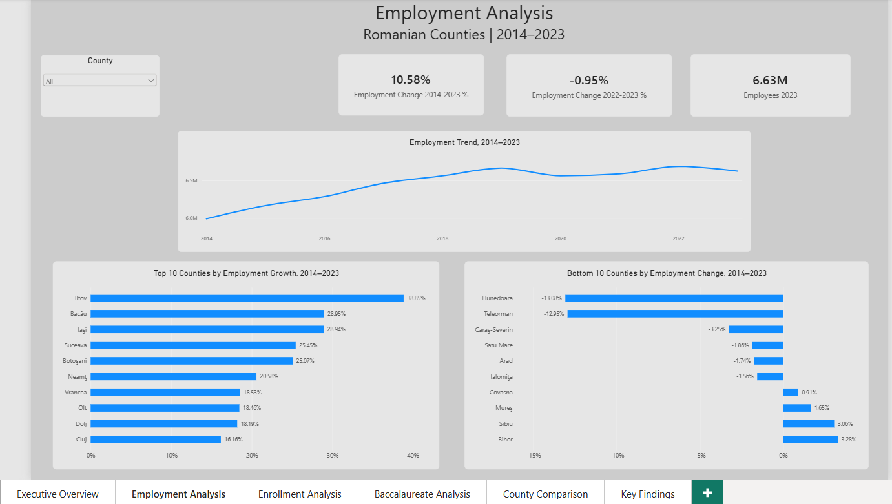
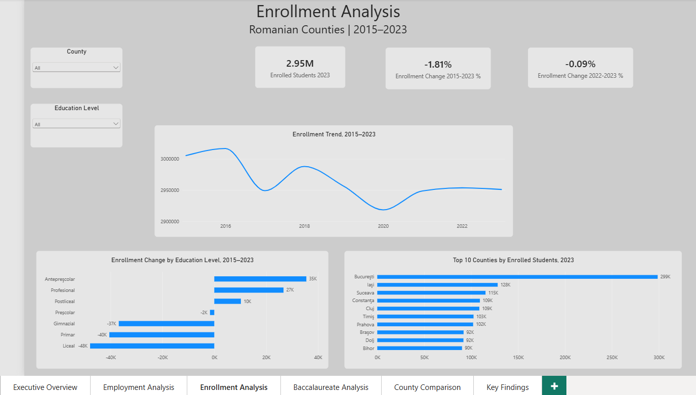
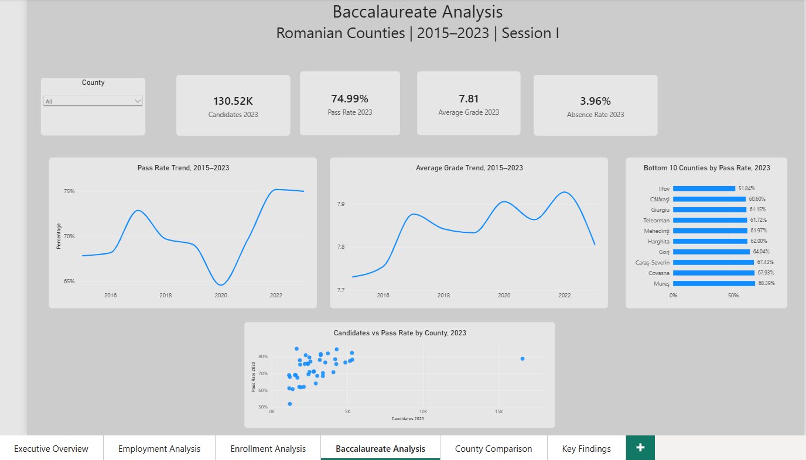
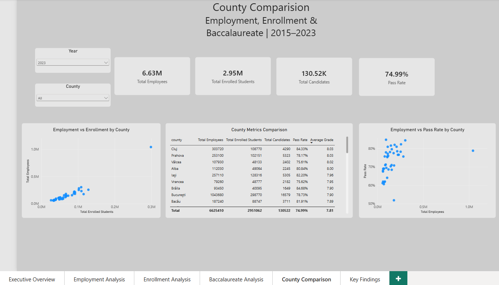
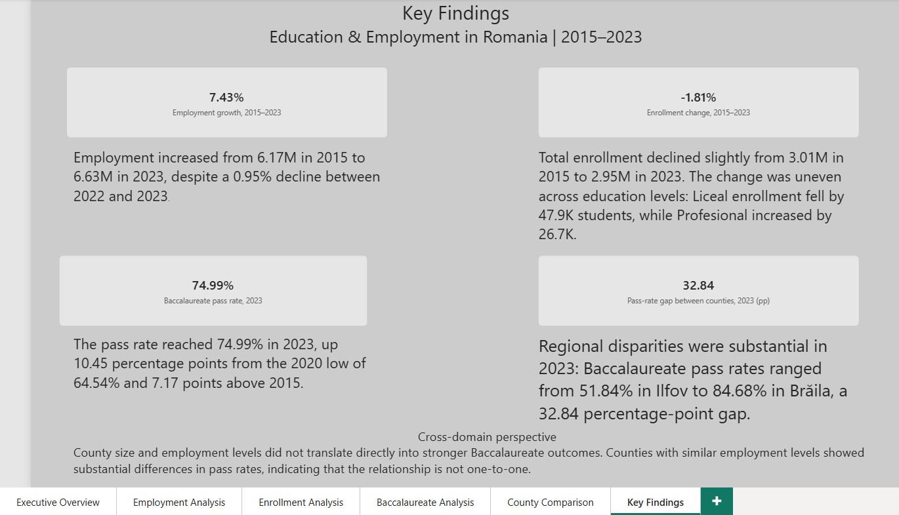

# Education & Employment in Romania

## Reproducible Python Data Pipelines and Power BI Analysis | 2014–2023

<p align="left">
  <a href="https://github.com/osaci-cosmin/romania-education-employment-powerbi/raw/refs/heads/main/powerbi/romania_education_employment.pbix">
    
  </a>
</p>

> The complete `.pbix` file is available for download and can be opened locally with Microsoft Power BI Desktop.

This project analyzes **employment, school enrollment, and Baccalaureate outcomes across Romanian counties** using reproducible Python data-processing pipelines and an interactive Power BI report.

The project combines:

```text
Python
pandas
REST APIs
CKAN APIs
JSON / JSON-stat
Excel / ODS processing
data profiling
data cleaning
data validation
cross-source harmonization
Power BI
DAX
dimensional modelling
interactive analytics
```

The final analytical model covers all **42 Romanian county-level NUTS 3 units**.

The main common analytical period is:

```text
2015–2023
```

Employment additionally includes 2014 to provide a longer baseline.

---

# Dashboard Preview



---

# Project Evolution

This repository contains the current rebuilt version of the project.

The original version was primarily a Power BI dashboard based on Romanian education and employment indicators.

The project was subsequently redesigned and extended with:

```text
reproducible Python data pipelines
multi-source ingestion
cross-year schema handling
data-quality validation
NUTS 3 geographical harmonization
candidate-level Baccalaureate processing
aggregated analytical datasets
dimensional Power BI modelling
DAX measures
cross-domain analysis
privacy-aware repository curation
```

The repository URL was intentionally preserved so that existing portfolio and CV links continue to point to the current version of the project.

The previous dashboard version is preserved separately in the repository history / legacy branch, while `main` contains the rebuilt project.

---

# Analytical Scope

The final project contains three production analytical domains:

```text
Employment
Enrollment
Baccalaureate
```

A Higher Education component was also investigated but intentionally deferred because a sufficiently reproducible and geographically compatible **County × Year** source was not obtained through the tested programmatic routes.

---

# Data Sources

## Employment

Source:

```text
Eurostat
```

Dataset:

```text
nama_10r_3empers
```

Selection:

```text
Frequency: Annual
Unit: Thousand persons
Employment status: Employees
Economic activity: Total
Geographical level: Romanian NUTS 3
Period: 2014–2023
```

Final analytical grain:

```text
County × Year
```

Processed dataset:

```text
data/processed/employment_clean.csv
```

Final shape:

```text
420 rows
42 counties
10 years
```

---

## Enrollment

Source:

```text
data.gov.ro
Official Romanian education open datasets
```

School-year period:

```text
2015-2016 → 2023-2024
```

The project preserves the original temporal field:

```text
school_year
```

and derives:

```text
analysis_year
```

from the starting year of each school year.

Example:

```text
2015-2016 → analysis_year = 2015
2023-2024 → analysis_year = 2023
```

This creates the common analysis range:

```text
2015–2023
```

This mapping is a modelling convention and does not imply that a school year and a calendar year represent identical periods.

Final analytical grain:

```text
County × School Year × Education Level
```

Seven formal education levels are retained:

```text
Antepreşcolar
Preșcolar
Primar
Gimnazial
Profesional
Liceal
Postliceal
```

Processed dataset:

```text
data/processed/enrollment_clean.csv
```

Final shape:

```text
2,432 rows
42 counties
9 school years
7 formal education levels
```

---

## Baccalaureate

Source:

```text
Official annual Romanian Baccalaureate open datasets
Session I
```

Period:

```text
2015–2023
```

The annual source files differ substantially across years in structure and format.

The pipeline therefore performs:

```text
source inventory
format inspection
cross-year normalization
candidate validation
SIIIR normalization
county mapping
status normalization
final-grade normalization
candidate-level standardization
County × Year aggregation
final validation
```

The standardized candidate-level intermediate layer remains local and is not part of the public dataset layer.

Final analytical grain:

```text
County × Year
```

Processed dataset:

```text
data/processed/baccalaureate_clean.csv
```

Final shape:

```text
378 rows
42 counties
9 years
```

---

# Data Engineering Workflow

The overall architecture is:

```text
Official public sources
        ↓
Python ingestion
        ↓
Raw data preservation
        ↓
Schema inspection and diagnosis
        ↓
Transformation and normalization
        ↓
Data-quality validation
        ↓
Processed analytical datasets
        ↓
Power BI
        ↓
Dimensional semantic model
        ↓
DAX measures
        ↓
Interactive dashboard
```

The project deliberately separates:

```text
raw data
intermediate data
processed data
source code
documentation
Power BI artifacts
```

This makes the workflow easier to inspect, validate, maintain, and reproduce.

---

# Data Quality and Validation

Each pipeline contains explicit data-quality checks.

Examples include:

```text
row-count validation
missing-value checks
duplicate analytical-key checks
non-negative numeric validation
integer validation
year coverage validation
county coverage validation
education-level validation
candidate uniqueness validation
SIIIR normalization checks
status / grade consistency checks
cross-dataset county-code validation
```

A final cross-dataset validator is implemented in:

```text
src/48_validate_processed_datasets.py
```

Final validation result:

```text
Errors:   0
Warnings: 0

FINAL STATUS: PASS
```

The processed datasets passed structural and analytical validation before Power BI modelling.

---

# Power BI Semantic Model

The final Power BI model uses a **fact-constellation / galaxy architecture**.

## Fact Tables

```text
FactEmployment
FactEnrollment
FactBaccalaureate
```

## Dimension Tables

```text
DimCounty
DimYear
DimEducationLevel
```

## Relationships

The final model contains:

```text
7 active relationships
all many-to-one
single-direction filtering
0 many-to-many relationships
0 bidirectional relationships
0 fact-to-fact relationships
```

Shared analytical dimensions allow the three domains to be filtered consistently by geography and time.

---

# Key DAX Aggregation Rules

Some Baccalaureate indicators cannot be averaged directly across counties or years.

The correct aggregated pass rate is:

```text
SUM(passed_candidates)
/
SUM(present_candidates)
```

and not:

```text
AVERAGE(pass_rate)
```

Likewise, the correct aggregated average grade is:

```text
SUM(final_grade_sum)
/
SUM(graded_candidates)
```

and not:

```text
AVERAGE(average_grade)
```

This ensures that selections covering multiple counties or years are weighted using the underlying candidate populations.

---

# Power BI Report

The final report contains six analytical pages.

## 1. Executive Overview

The Executive Overview provides a national snapshot of the three analytical domains.

Main KPIs include:

```text
Total Employees
Total Enrolled Students
Total Candidates
Pass Rate
Average Grade
```

The page also includes:

```text
Enrollment by Education Level
Top 10 Counties by Employment
Top 10 Counties by Baccalaureate Pass Rate
```


---

## 2. Employment Analysis

This page focuses on:

```text
employment evolution
long-term employment change
recent annual change
county growth
county decline
```

Analytical period:

```text
2014–2023
```

Selected national results:

```text
Employment change 2014–2023: +10.58%
Employment change 2022–2023: -0.95%
Employees in 2023: approximately 6.63M
```



---

## 3. Enrollment Analysis

This page examines:

```text
national enrollment evolution
long-term enrollment change
recent enrollment change
changes by education level
county comparisons
```

Main analytical period:

```text
2015–2023
```

Selected results:

```text
Enrolled students 2023: approximately 2.95M
Enrollment change 2015–2023: -1.81%
Enrollment change 2022–2023: -0.09%
```



---

## 4. Baccalaureate Analysis

This page focuses on:

```text
candidate volume
pass rate
average grade
absence rate
national trends
county differences
```

The analysis consistently uses:

```text
Session I
2015–2023
```

2023 national results:

```text
Candidates:      130.52K
Pass Rate:       74.99%
Average Grade:   7.81
Absence Rate:    3.96%
```



---

## 5. County Comparison

The County Comparison page brings together:

```text
Employment
Enrollment
Baccalaureate
```

under common county and year filters.

It contains:

```text
Employment vs Enrollment by County
County Metrics Comparison
Employment vs Baccalaureate Pass Rate
```

Scatter plots are used to explore relationships between domains.

These relationships are interpreted descriptively and should not be interpreted as causal effects.



---

## 6. Key Findings

The final page summarizes the main results of the analysis.



Selected findings include:

```text
Employment growth 2015–2023:
+7.43%

Enrollment change 2015–2023:
-1.81%

Baccalaureate pass rate 2023:
74.99%

County pass-rate gap 2023:
32.84 percentage points
```

---

# Selected Analytical Findings

## Employment

National employment increased from approximately:

```text
6.17 million employees in 2015
```

to:

```text
6.63 million employees in 2023
```

representing approximately:

```text
+7.43%
```

The longer 2014–2023 comparison shows:

```text
+10.58%
```

while the latest annual change was:

```text
2022–2023: -0.95%
```

---

## Enrollment

Total enrollment changed from approximately:

```text
3.01 million students in 2015
```

to:

```text
2.95 million students in 2023
```

representing:

```text
-1.81%
```

The overall national change was relatively small, but trends differed substantially by education level.

Examples:

```text
Liceal:
approximately -47.9K students

Profesional:
approximately +26.7K students
```

---

## Baccalaureate

National Baccalaureate results in 2023:

```text
Candidates:      130.52K
Pass Rate:       74.99%
Average Grade:   7.81
Absence Rate:    3.96%
```

The 2023 pass rate was approximately:

```text
+10.45 percentage points
```

above the 2020 low and:

```text
+7.17 percentage points
```

above 2015.

County pass rates in 2023 ranged approximately from:

```text
51.84% — Ilfov
```

to:

```text
84.68% — Brăila
```

resulting in a:

```text
32.84 percentage-point gap
```

---

# Cross-Domain Perspective

The three domains do not move uniformly across Romanian counties.

Employment levels and county size do not translate directly into stronger Baccalaureate outcomes.

Counties with similar employment levels can display substantially different pass rates.

These patterns are interpreted as **descriptive associations**, not causal relationships.

---

# Repository Structure

```text
romania-education-employment-powerbi/
│
├── data/
│   └── processed/
│       ├── employment_clean.csv
│       ├── enrollment_clean.csv
│       └── baccalaureate_clean.csv
│
├── docs/
│   ├── development_log.md
│   └── images/
│       ├── executive_overview.png
│       ├── employment_analysis.png
│       ├── enrollment_analysis.png
│       ├── baccalaureate_analysis.png
│       ├── county_comparison.png
│       └── key_findings.png
│
├── powerbi/
│   └── romania_education_employment.pbix
│
├── src/
│   ├── 02_test_eurostat_api.py
│   ├── 03_ingest_employment.py
│   ├── 04_transform_employment.py
│   ├── 12_ingest_all_enrollment.py
│   ├── 18_transform_all_enrollment.py
│   ├── 21_inventory_baccalaureate_sources.py
│   ├── 26_ingest_all_baccalaureate.py
│   ├── 30_fast_count_baccalaureate_2016_ods.py
│   ├── 32_validate_siiir_county_mapping.py
│   ├── 34_diagnose_baccalaureate_2022_final_results.py
│   ├── 37_ingest_baccalaureate_2017_ods.py
│   ├── 39_validate_baccalaureate_core_all_years.py
│   ├── 41_profile_baccalaureate_results_all_years.py
│   ├── 42_transform_baccalaureate_candidate_level.py
│   ├── 43_aggregate_baccalaureate.py
│   └── 48_validate_processed_datasets.py
│
├── .gitignore
└── README.md
```

---

# Privacy and Data Governance

The local development workspace also contains:

```text
data/raw/
data/interim/
```

These directories are excluded from the public repository through `.gitignore`.

The Baccalaureate intermediate file:

```text
data/interim/baccalaureate_candidate_standardized.csv
```

contains candidate-level identifiers used internally for:

```text
validation
uniqueness checks
SIIIR normalization
county mapping
result normalization
aggregation
```

It is intentionally excluded from the public repository.

Only aggregated Baccalaureate information is used in the final public analytical layer and Power BI model.

The public source-code selection was also reviewed to exclude unnecessary diagnostic scripts capable of displaying individual candidate identifiers.

The publication workflow was explicitly checked so that the following were not staged or published:

```text
data/raw/
data/interim/
data/processed/enrollment_2015_2016_clean.csv
```

---

# Reproducibility

The curated public source code preserves the main processing workflow.

A simplified execution sequence is:

```text
EMPLOYMENT

02_test_eurostat_api.py
        ↓
03_ingest_employment.py
        ↓
04_transform_employment.py


ENROLLMENT

12_ingest_all_enrollment.py
        ↓
18_transform_all_enrollment.py


BACCALAUREATE

21_inventory_baccalaureate_sources.py
        ↓
26_ingest_all_baccalaureate.py
        ↓
source-format diagnostics and validation
        ↓
42_transform_baccalaureate_candidate_level.py
        ↓
43_aggregate_baccalaureate.py


FINAL VALIDATION

48_validate_processed_datasets.py
```

Additional Baccalaureate scripts in `src/` handle specific historical source-format issues and validation steps.

Raw source files are not distributed directly in the repository.

Relevant ingestion scripts and the development documentation describe how official resources were obtained and processed.

The complete development history, including exploratory and superseded scripts, is documented in:

```text
docs/development_log.md
```

---

# Methodological Notes

## Enrollment Time Alignment

Enrollment data are reported by school year.

The project defines:

```text
analysis_year = starting year of school_year
```

This enables controlled comparison with annual Employment and Baccalaureate datasets.

It should not be interpreted as meaning that a school year and a calendar year represent identical time periods.

---

## Baccalaureate Session Scope

The Baccalaureate analysis uses:

```text
Session I
```

for every year from:

```text
2015 through 2023
```

This provides a consistent annual comparison.

---

## Weighted Aggregation

Baccalaureate pass rates and average grades are recalculated from the underlying counts and grade sums.

Pre-calculated county-level ratios are not directly averaged.

---

## Analytical Interpretation

The project is descriptive and exploratory.

Observed relationships between:

```text
employment
enrollment
Baccalaureate outcomes
```

should be interpreted as associations.

They do not demonstrate causality.

---

# Limitations

```text
Enrollment uses school years while Employment and Baccalaureate use calendar years.

The common analysis year is therefore a modelling convention.

Baccalaureate analysis uses Session I only.

Employment is based on the selected Eurostat employee indicator.

Higher Education was investigated but not integrated.

The analysis is primarily descriptive and does not establish causal relationships.
```

---

# Tools and Technologies

```text
Python
pandas
requests
REST APIs
CKAN API
JSON
JSON-stat
Excel
ODS / XML processing
Power BI
Power Query
DAX
Git
GitHub
AI-assisted development (ChatGPT)
```
# AI-Assisted Development

AI tools, including **ChatGPT**, were used as a development assistant throughout parts of this project.

AI assistance was used primarily for:

```text
brainstorming and project structuring
debugging support
code review and explanation
Power BI and DAX troubleshooting
methodological discussion
documentation drafting and refinement
repository organization
```

AI-generated suggestions were treated as development support rather than as authoritative results.

The underlying work — including data-source selection, execution of the Python pipelines, inspection of source files, transformation decisions, data-quality validation, Power BI modelling, dashboard construction, and final analytical interpretation — was reviewed and implemented by the author.

Where factual or methodological claims depended on external information, official data sources and documentation were prioritized for verification.

The final datasets, analytical results, visualizations, and repository contents were manually reviewed before publication.

---

# Documentation

Detailed technical and methodological development history is available in:

```text
docs/development_log.md
```

The development log documents:

```text
source investigation
pipeline construction
schema changes
data-quality issues
diagnostic decisions
Enrollment harmonization
Baccalaureate normalization
Higher Education investigation
processed-data validation
Power BI model design
DAX development
dashboard development
repository curation
privacy decisions
GitHub publication
```

---

# Data Sources and Licensing

This project uses official public statistical and open-data sources.

## Employment

Employment data are derived from:

```text
Eurostat
Dataset: nama_10r_3empers
```

Eurostat permits reuse of its statistical data for commercial and non-commercial purposes provided that the source is acknowledged.

The dataset used in this project was filtered, transformed, geographically standardized, and aggregated for analytical use.

```text
Source: Eurostat
Dataset: nama_10r_3empers
Transformations: performed by the project author
```

Eurostat is not responsible for the transformations, derived datasets, analytical calculations, or interpretations produced in this repository.

## Enrollment

Enrollment data originate from official datasets published by the Romanian Ministry of Education through:

```text
data.gov.ro
```

The Enrollment resources used by this project are published under:

```text
Creative Commons Attribution 4.0 International
CC BY 4.0
```

The project transforms and aggregates the original resources into:

```text
data/processed/enrollment_clean.csv
```

The original resource references are preserved in:

```text
src/12_ingest_all_enrollment.py
```

## Baccalaureate

Baccalaureate data originate from official annual datasets published through:

```text
data.gov.ro
Romanian Ministry of Education
```

Licensing metadata varies across the annual source resources.

Licenses represented among the source datasets include:

```text
OGL-ROU-1.0
Creative Commons Attribution 4.0 International
```

The project therefore does not assign a single replacement license to the original Baccalaureate source data.

The public dataset:

```text
data/processed/baccalaureate_clean.csv
```

is a derived County × Year analytical dataset created through normalization and aggregation of the official annual sources.

Reuse of source-derived information remains subject to the applicable license and attribution conditions of the original resources.

Original annual resource references are preserved in:

```text
src/26_ingest_all_baccalaureate.py
```

## Public Data Layer

The repository intentionally excludes:

```text
data/raw/
data/interim/
```

including the candidate-level Baccalaureate intermediate dataset.

Only the final processed analytical datasets are published:

```text
data/processed/employment_clean.csv
data/processed/enrollment_clean.csv
data/processed/baccalaureate_clean.csv
```

These files contain transformed or aggregated analytical outputs derived from the official sources described above.

## Project Code

Original source code authored for this project is released under the MIT License.

The MIT License applies to the project code and does not replace or override the licenses, attribution requirements, or other rights associated with third-party or source-derived datasets.

Users wishing to reuse the processed datasets should preserve attribution to the relevant original data providers and consult the licensing metadata of the corresponding source resources.

# Future Improvements

Possible extensions include:

```text
Higher Education integration
automatic pipeline orchestration
scheduled data refresh
config-driven ingestion
additional socioeconomic indicators
statistical modelling
forecasting
clustering
automated testing
metadata-driven processing
```

---

# Project Status

```text
Employment pipeline         ✅ COMPLETE
Enrollment pipeline         ✅ COMPLETE
Baccalaureate pipeline      ✅ COMPLETE

Processed-data validation   ✅ PASS

Power BI model              ✅ COMPLETE
DAX measures                ✅ COMPLETE
Dashboard                   ✅ COMPLETE
Dashboard screenshots       ✅ COMPLETE

Public source-code curation ✅ COMPLETE
Privacy review              ✅ COMPLETE
README / documentation      ✅ COMPLETE
GitHub publication          ✅ COMPLETE

Final licensing review      ✅ COMPLETE
```

The rebuilt project has been published to the existing GitHub repository URL while preserving the legacy project version separately.

---

# Author

**Cosmin-Gabriel Osaci**

Portfolio project focused on:

```text
Data Analysis
Data Engineering
Business Intelligence
Data Quality
Reproducible Analytics
```
